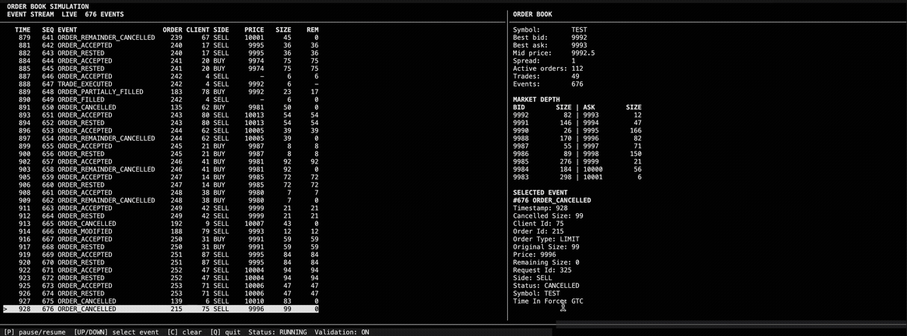

# Limit Order Book

A from-scratch exchange-style limit order book and matching engine built to study order matching, market microstructure and performance-oriented systems design.



The current implementation is written in Python and includes the matching engine, stochastic order-flow simulator, state validation, tests and an interactive terminal dashboard.

A Rust implementation of the core matching engine is planned for correctness and performance comparison.

## Features

- Price-time priority matching
- Limit and market orders
- GTC, IOC and FOK time-in-force instructions
- Order submission, cancellation and modification
- Partial and complete fills
- FIFO ordering within each price level
- Constant-time active-order lookup by order ID
- Best bid, best ask, spread and mid-price queries
- Full and depth-limited order book snapshots
- Structured engine event stream
- Configurable stochastic order-flow simulation
- Deterministic simulation through fixed random seeds
- Optional full-state validation after every request
- Interactive terminal dashboard
- Standard-library-only runtime

## Matching behaviour

Incoming orders match against the best available price on the opposite side of the book.

Within a price level, resting orders are matched in FIFO order. Trades execute at the resting order's price.

Time-in-force behaviour:

- **GTC:** any unfilled limit-order quantity rests in the book
- **IOC:** any unfilled quantity is cancelled immediately
- **FOK:** the order is cancelled unless its full quantity can execute immediately

Order modification follows standard queue-priority rules:

- Decreasing size retains priority
- Increasing size moves the order to the back of its price-level queue
- Changing price removes the order from its current level and processes it again at the new price

## Quick start

### Requirements

- Python 3.10 or later
- A terminal with `curses` support

Clone the repository:

```bash
git clone https://github.com/sachin-peterson/limit_order_book.git
cd limit_order_book
```

Create and activate a virtual environment:

```bash
python3 -m venv .venv
source .venv/bin/activate
```

Install the project:

```bash
make install
```

## Run the dashboard

```bash
make dashboard
```

Dashboard settings can be overridden from the command line:

```bash
make dashboard \
    ACTIONS=1000 \
    SEED=42 \
    REQUEST_DELAY=0.25 \
    DEPTH=10
```

The dashboard displays:

- A live engine event stream
- Best bid and ask
- Mid-price and spread
- Bid and ask market depth
- Active order, trade and event counts
- Full details for the selected event

Controls:

```text
Q          Quit
P          Pause or resume
Up/Down    Select an event
End        Return to live mode
```

The dashboard can also be run directly:

```bash
python3 -m order_book_python.cli.run_dashboard \
    --actions 1000 \
    --seed 42 \
    --validate \
    --request-delay 0.25 \
    --depth 10
```

## Run the tests

```bash
make test
```

Equivalent command:

```bash
python3 -m unittest discover \
    -s order_book_python/tests \
    -t . \
    -p "test_*.py" \
    -v
```

## Architecture

The order book maintains an independent data structure for each side of the market.

| Component | Implementation | Purpose |
|---|---|---|
| Book side | Binary search tree | Stores and orders price levels |
| Price level | Doubly linked FIFO queue | Maintains time priority |
| Order index | Dictionary | Finds active orders by order ID |
| Best-price pointer | Cached tree node | Provides direct best bid or ask access |
| Event log | Append-only list | Records engine state changes |

Each price-tree node owns one price level. Each price level contains every resting order at that price in arrival order.

The order index points directly to each resting order's queue node. This allows cancellation and modification without scanning the full book.

### Complexity

Let:

- `P` be the number of price levels
- `h` be the height of the price tree
- `N` be the number of active orders

| Operation | Complexity |
|---|---:|
| Best bid or ask lookup | `O(1)` |
| Active-order lookup | Expected `O(1)` |
| Price-level lookup | `O(h)` |
| Price-level insertion or removal | `O(h)` |
| Append to a price-level queue | `O(1)` |
| Remove from a price-level queue | `O(1)` |
| Traverse all price levels | `O(P)` |

The current price tree is not self-balancing. Its average performance depends on insertion order and its worst-case height is `O(P)`. Random, ascending and descending insertion patterns will therefore be included in the benchmark suite.

## Project structure

```text
limit_order_book/
├── order_book_python/
│   ├── cli/
│   │   ├── dashboard.py
│   │   └── run_dashboard.py
│   ├── engine/
│   │   ├── types/
│   │   ├── book_side.py
│   │   ├── matching_engine.py
│   │   ├── order_validation.py
│   │   ├── price_level.py
│   │   └── state_validation.py
│   ├── simulation/
│   └── tests/
├── Makefile
├── pyproject.toml
└── README.md
```

## State validation

The engine includes an optional validator for checking internal consistency.

Validation covers:

- Price-tree structure and parent pointers
- Correct bid and ask ordering
- Cached best-price pointers
- FIFO queue links
- Price-level order counts and total sizes
- Order-index consistency
- Order side and price consistency
- Event sequence consistency
- Crossed-book conditions

Validation is intended for testing and debugging rather than performance measurements.

## Simulation

The simulator generates configurable streams of new, cancel and modify requests.

Its random seed controls reproducibility:

```bash
make dashboard SEED=42
```

Running the same configuration with the same seed produces the same generated request sequence.

The current simulator is a synthetic baseline. It is not yet calibrated to empirical market data.

## Current limitations

- Single-threaded and in memory
- Unbalanced price trees
- Integer prices and order quantities
- No networking, persistence or exchange gateway
- Synthetic order flow rather than empirically calibrated order flow
- Intended for study and experimentation rather than production trading

## Roadmap

1. Add deterministic Python engine benchmarks
2. Benchmark common and worst-case book shapes
3. Implement the core matching engine in Rust
4. Add shared Python and Rust conformance workloads
5. Compare Python and Rust latency and throughput
6. Add real market-data reconstruction
7. Calibrate and evaluate statistical order-flow models

## Research direction

The longer-term goal is to use real event-level market data to evaluate how different order-flow assumptions affect simulated order-book behaviour.

The existing stochastic simulator will serve as the baseline for comparison with empirically calibrated and state-dependent models.